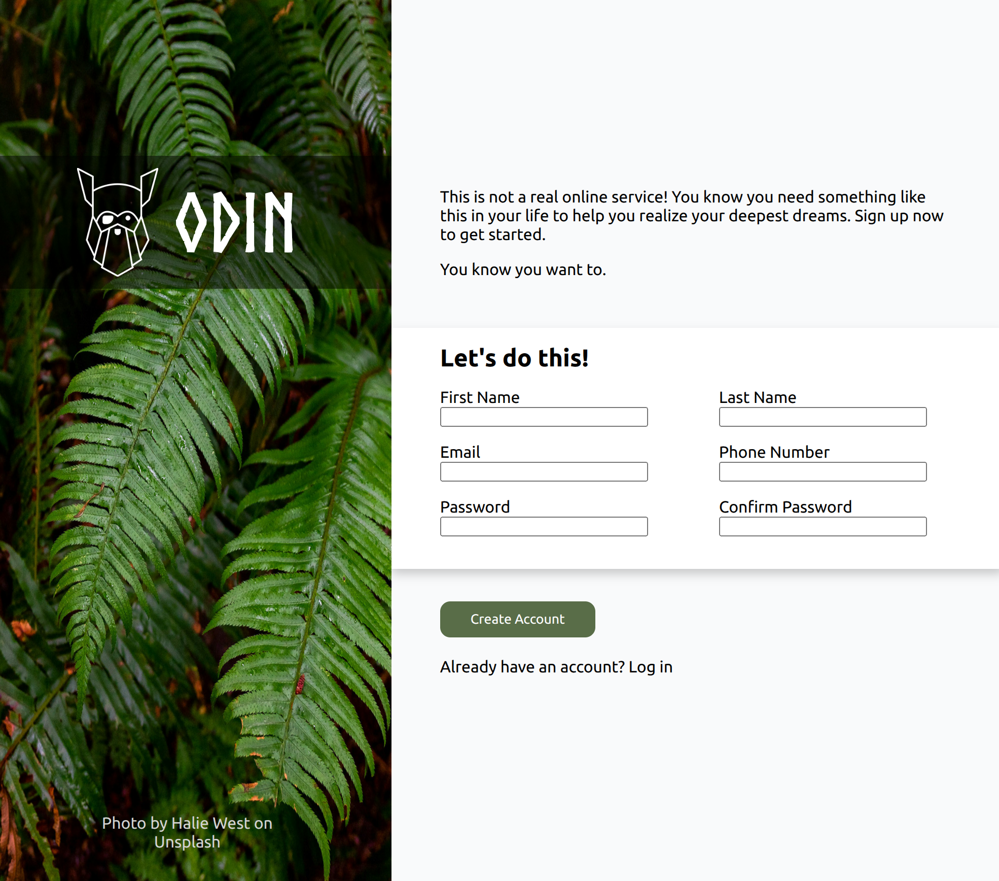

# Odin Form
In this project, I used new knowledge on forms, positioning, fonts, and some previous knowledge to make a login form.

Using relative and absolute positioning allowed me to position text over an image.

Using form allowed me to set types of inputs and css user-valid to change the color based on if the input is valid or not.

